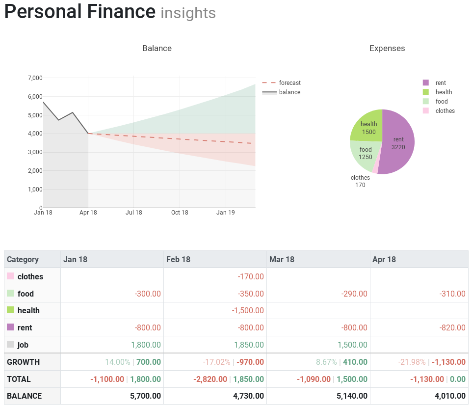

# Personal Finance Dashboard

This program uses plotly's [dash](https://github.com/plotly/dash) library to visualize personal finances. It draws all its data from a single CSV file where all transactions are recorded and then shown on the dashboard. The balance plot uses ARIMA to forecast.



## Usage

### Install Dependencies
* Math: numpy, pandas, pyramid-arima
* Dashboard: dash, dash-renderer, dash-html-components, dash-core-components
* Plotting: plotly

You probably want to install them with `pip` or `conda`.

### Edit configuration
You can find configuration such as color scheme, date format etc. in `config.py`

### Add transactions
In order to visualize your finances you need to keep track of your transactions in the transactions file specified in `config.py`. It's just list that tracks income and expenses.

### Run
```shell
python dashboard.py
```


